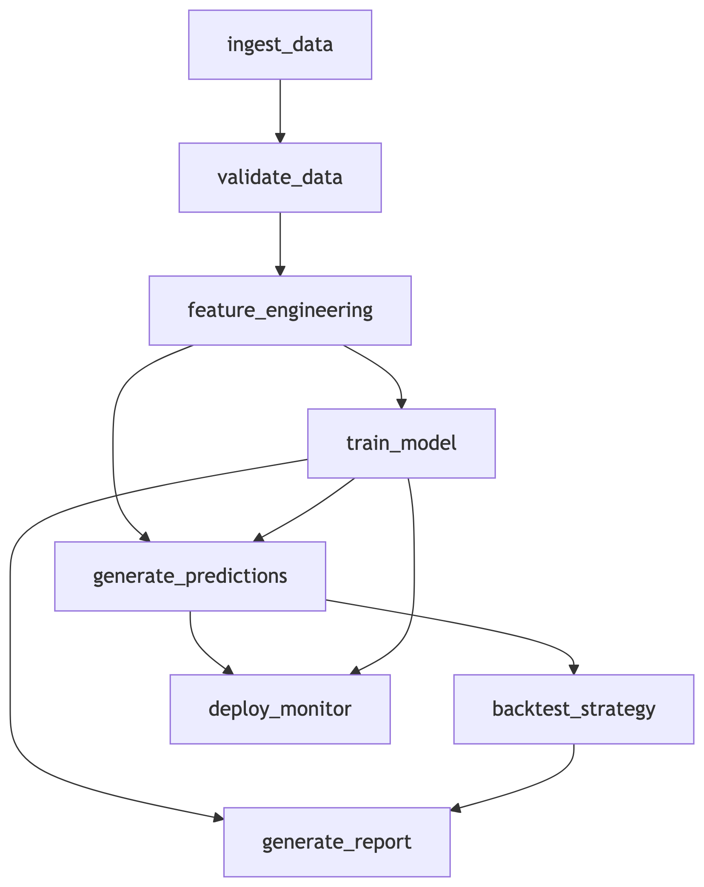

# Orchestration Plan: SPY ETF Forecasting System

## 1. Project Task Decomposition

| Task | Description | Input(s) | Output(s) | Idempotent | Why Idempotent? |
|------|-------------|----------|-----------|------------|-----------------|
| **ingest_data** | Daily data collection from yfinance API | yfinance API endpoint | `data/raw/raw_data_{date}.parquet` | No | API returns new daily data each run |
| **validate_data** | Data quality checks and schema validation | `data/raw/raw_data_{date}.parquet` | `data/processed/validated_data_{date}.parquet` | Yes | Validation results consistent for same input |
| **feature_engineering** | Technical indicator calculation | `data/processed/validated_data_{date}.parquet` | `data/features/features_{date}.parquet` | Yes | Deterministic transformations |
| **train_model** | Model training and evaluation | `data/features/features_{date}.parquet` | `models/model_{date}.pkl` + `metrics/metrics_{date}.json` | Yes | Same features → same model |
| **generate_predictions** | Daily prediction generation | `models/model_{date}.pkl` + `data/features/features_{date}.parquet` | `predictions/predictions_{date}.parquet` | Yes | Deterministic inference |
| **backtest_strategy** | Strategy performance evaluation | `predictions/predictions_{date}.parquet` | `backtests/backtest_{date}.parquet` | Yes | Same predictions → same backtest results |
| **generate_report** | Performance reporting and visualization | `backtests/backtest_{date}.parquet` + `metrics/metrics_{date}.json` | `reports/report_{date}.html` | Yes | Same inputs → same report |
| **deploy_monitor** | Model deployment and monitoring | `predictions/predictions_{date}.parquet` + `models/model_{date}.pkl` | `monitoring/dashboard_{date}.json` | Yes | Monitoring stats based on current data |

## 2. Dependencies (DAG)

**Parallelizable Tasks:**
- `train_model` and `generate_predictions` can run concurrently after `feature_engineering`
- `backtest_strategy` and `deploy_monitor` can run in parallel after `generate_predictions`

## 3. Logging & Checkpoint Strategy

| Task | Log Messages | Checkpoint Artifact | Log Location |
|------|-------------|---------------------|-------------|
| **ingest_data** | start/end timestamps, rows ingested, API status, download duration | `data/raw/raw_data_{date}.parquet` | `logs/ingest_{date}.log` |
| **validate_data** | validation errors, row counts, schema changes, null percentages | `data/processed/validated_data_{date}.parquet` | `logs/validate_{date}.log` |
| **feature_engineering** | features created, transformation statistics, null counts | `data/features/features_{date}.parquet` | `logs/features_{date}.log` |
| **train_model** | model parameters, training metrics, feature importance, training time | `models/model_{date}.pkl` | `logs/train_{date}.log` |
| **generate_predictions** | prediction statistics, confidence intervals, execution time | `predictions/predictions_{date}.parquet` | `logs/predict_{date}.log` |
| **backtest_strategy** | performance metrics, Sharpe ratio, max drawdown, trade counts | `backtests/backtest_{date}.parquet` | `logs/backtest_{date}.log` |
| **generate_report** | report generation status, visualization metrics | `reports/report_{date}.html` | `logs/report_{date}.log` |
| **deploy_monitor** | monitoring metrics, drift detection, alert status | `monitoring/dashboard_{date}.json` | `logs/monitor_{date}.log` |

**Checkpoint Strategy:** All intermediate artifacts are versioned by date, allowing for partial re-runs and historical analysis. Parquet format ensures efficient storage and schema evolution.

## 4. Failure Points & Retry Policies

**Critical Failure Points:**

1. **API Rate Limiting (ingest_data)**
   - **Metric:** HTTP 429 responses
   - **Threshold:** >2 failures in 5 minutes
   - **Retry Policy:** Exponential backoff (3 attempts: 2s, 4s, 8s)
   - **Alert:** Data engineering team

2. **Data Schema Drift (validate_data)**
   - **Metric:** Schema validation errors
   - **Threshold:** Any schema mismatch
   - **Retry Policy:** No retries - fail fast for manual intervention
   - **Alert:** Quantitative research team

3. **Model Performance Degradation (train_model)**
   - **Metric:** AUC < 0.55 or PSI > 0.1
   - **Threshold:** 2 consecutive days of degradation
   - **Retry Policy:** Auto-rollback to previous model version
   - **Alert:** ML engineering team

4. **Prediction Service Latency (deploy_monitor)**
   - **Metric:** P95 latency > 100ms
   - **Threshold:** 5 minutes sustained latency
   - **Retry Policy:** Scale resources + fallback to cached predictions
   - **Alert:** Platform engineering team

**Retry Policies Summary:**
- **Transient failures** (API, network): 3 retries with exponential backoff
- **Data quality issues**: No retries - require manual investigation
- **Model issues**: No training retries - alert for human intervention
- **System issues**: Auto-scaling + fallback mechanisms

## 5. Automation Strategy

There are several processes that can be automated immediately. For example, the data ingestion and validation process can become a daily automated pipeline, and feature engineering can be automated through deterministic transformations. In addition, predictions can be automatically generated using daily batch scoring, basic monitoring/alerting can be automated checks in instead, and daily reports can also be automatically generated. On the other hand, there are still processes that need to be handled manually. For example, implementing any model retraining or strategy parameter changes requires human validation, and major processes such as production deployment and feature additions require rigorous testing prior to implementing.

**Rationale for Manual Components:**
- **Financial risk mitigation:** Model changes require human validation before affecting trading decisions
- **Regulatory compliance:** Audit trails needed for model changes in financial applications
- **Strategic decisions:** Parameter optimization and feature selection benefit from human expertise
- **Quality assurance:** Complex changes require thorough testing before automation

**Automation Roadmap:**
1. **Phase 1 (Now):** Automate data pipeline and daily predictions
2. **Phase 2 (Next):** Implement automated model performance monitoring
3. **Phase 3 (Future):** Add automated retraining with human approval workflow
4. **Phase 4 (Long-term):** Full CI/CD pipeline with automated testing and deployment